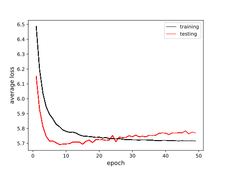
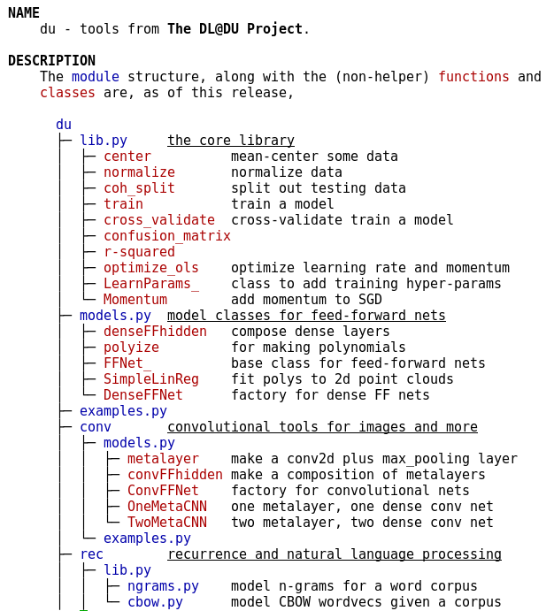
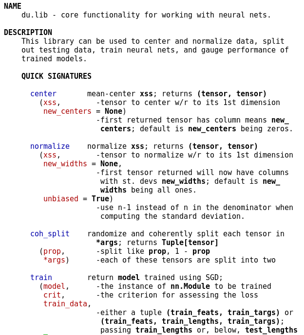
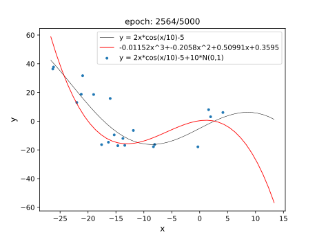
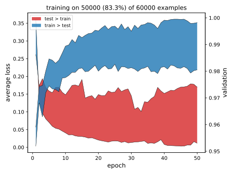

# DUlib

<a id="dldu"></a>
<p align="right"> <b> <a href="https://sj-simmons.github.io/dl"> The DL@DU Project</a> </b> </p>

### Contents
* [Quickstart](https://github.com/sj-simmons/DUlib#quickstart)
* [Detailed installation notes](https://github.com/sj-simmons/DUlib#detailed-installation-notes)
* [Release history](https://github.com/sj-simmons/DUlib#release-history)
  * [latest](https://github.com/sj-simmons/DUlib#latest)
* [Modifying](https://github.com/sj-simmons/DUlib#modifying-dulib)
* [Todo](https://github.com/sj-simmons/DUlib#todo)
* [Dev notes](#development-notes)

## Quickstart

DUlib assumes functioning installations of
[torch](https://pypi.org/project/torch/),
[matplotlib](https://pypi.org/project/matplotlib/), and
[scipy](https://pypi.org/project/scipy/).
* In an effort to circumvent dependency hell, we avoid using a
  [requirements file](https://pip.pypa.io/en/stable/user_guide/#requirements-files).
  DUlib strives to live harmoniously alongside any semi-modern versions
  of the three Python packages listed above. It runs on cheap Arm
  laptops, GPU servers in the cloud, and everything in-between.
* You may find [this page ](https://sj-simmons.github.io/dl/setup/dev_environ)
  at the [DL@DU Project](https://sj-simmons.github.io/dl/) useful when setting up
  a development environment for [PyTorch](https://pytorch.org).

At the command line, install the latest stable release of DUlib (from [pypi.org](https://pypi.org/project/DUlib/)):
```shell
pip3 install DUlib --user
```
(In the presence of a previously installed version, try `pip3 install --upgrade  DUlib --user`.)

Or, install the latest development release with, e.g.:
```shell
pip3 install git+https://github.com/sj-simmons/DUlib.git@v0.9.1  --user
```
Notes
* Safest practice is to replace **pip3** in the commands above (and below) with
  the command **/usr/bin/pip3**.
* Calling **pip3** with the **--user** switch is also good practice since, without
  it, you likely must use **sudo**, which installs possibly malicious code with
  super-user privileges. Mere mortals should never **sudo pip3 install some_package**
  unless they know what they are doing.
* If the command **pip** is available on your system, you can replace **pip3** above
  and below with just **pip** if, as in more modern Python installations, **pip**
  points to the Python3 version.  You can check this with `pip -V`.

You can now
* check that your previously installed [torch](https://pypi.org/project/torch/),
  [matplotlib](https://pypi.org/project/matplotlib/), and
  [scipy](https://pypi.org/project/scipy/) are available and  integrated into
  your development environment by running one of the pre-built programs that
  is included with DUlib.

  Run a program that fits a polynomial using linear regression
  by issuing at your command-line:
  ```shell
  dulib_polyreg_anim
  ```
  If that command is not found, see [here](#here1) in the detailed
  installation notes below for how to set your PATH variable.

  If the command is found, then the program should train for a model
  for 2500 epochs and then throw up a gui window and run an animation
  while it trains for another 2500 epochs.  If the gui never pops up,
  then see [here](#here2) in the detailed install notes.

* have a look at the module structure of DUlib:
  ```bash
  pd du
  ```
  If, instead of seeing readable text with color highlighting
  (something like [this](https://github.com/sj-simmons/DUlib#highlight)), you see
  escape sequences scattered all over, then see the detailed installation
  notes below ([here](https://github.com/sj-simmons/DUlib#char_esc_hell)).

* work through some demonstrations that illustrate basic usage:
  ```shell
  pd du.examples
  ```

### Detailed installation notes

By now you are likely aware of [python environment
hell](https://imgs.xkcd.com/comics/python_environment.png).  We recommend simply
*always* installing DUlib using the **--user** option with **pip3** &mdash; unless
you are installing system-wide for multiple users, in which case prefacing with
**sudo** (and dropping **--user**) might be best.

At the command line, install the latest release:
``` bash
pip3 install DUlib --user
```
(or `pip3 install --upgrade  DUlib --user` in the presence of a previously
installed version).

Notes
* If you don't have a **pip3** command, then your **pip** command must in fact
  *be* **pip3** (you can check this with `pip -V`).  In this case, just use
  ``` bash
  pip install DUlib --user
  ```
  or, more safely,
  ``` bash
  /usr/bin/pip install DUlib --user
  ```
* If you've previously installed several different versions of DUlib and especially
  if you've installed from a local cloned version of this repo, then things
  on your system might be kind of a mess. Consider reinstalling after first
  uninstalling DUlib with:
  ``` bash
  pip3 uninstall DUlib
  ```
  You might also try forcing an upgrade
  ``` bash
  pip3 install --upgrade   DUlib --force --user
  ```
* To verify without doubt that DUlib is installed, start up the Python3
  interpreter and type `import du`. If you see no errors, then you are good.

<a id="here1"></a>
Assuming that you installed using **--user**, various DUlib related executables should
now be installed in a certain subdirectory below your home directory. We want
that subdirectory to be in your PATH.

Type `which pd` at the command line. If you see something
like **/home/your_username/.local/bin/pd** (in Linux or the WSL) or
**/Users/your_username/Library/Python/3.8/bin/pd** (on a Mac), then you
are in good shape; so, skip to just below the next two bullet-points.
If you see nothing, then likely you need to adjust your PATH variable
by running the following command at the command line:
```shell
echo "export PATH=$PATH:~/.local/bin" >> ~/.profile
```
alternatively, on a Mac, you may need to run something like
``` bash
echo "export PATH=$PATH:~/Library/Python/3.8/bin" >> ~/.profile
```
Notes
* Your PATH will *not* automatically be updated for the remainder of
  your shell session.  To update without restarting your system do:
  ```shell
  source ~/.profile
  ```
  Now retry `which pd`.
* Each time you run, for instance, the first command above that
  begins with **echo**, the line **export PATH=$PATH:~/.local/bin** is appended
  to your **.profile** file. If you've run that command more
  than once, you may want to edit **.profile** and delete any duplicate lines.

Now check, as in the Quickstart section above, that you can run one of the
pre-installed executables; for example:
```shell
dulib_polyreg_anim
```
<a id="here2"></a>
This command should train a model in your console for 2500 epochs then
throw up a gui window and train for another 2500 epochs while showing
an animation.  If the gui never pops up or if it pops up and is static,
then we troubleshoot as follows.

If you are running on a Mac, there's a good chance that the matplotlib
backend needs to be adjusted. We do this by editing the file
**matplotlibrc**.
* First, let us find **matplotlibrc**. In the Python 3 interpreter type:
  ```python
  >>> import matplotlib
  >>> matplotlib.matplotlib_fname()
  ```
* We want to edit that file.  Find the line **#backend: agg** or **backend: agg**.
* In September '20, a DUlib user reported that the following
  worked on their machine:
  * At the commandline:
    ```shell
    brew install pyqt
    pip install PyQt5
    ```
  * In **matplotlibrc**, you want:
    ```shell
    backend: Qt5Agg
    ```
    (That line  should *not* be commented out.)
* In December '19, a DUlib and Mac user reported that **backend: TkAgg**
  worked to get the animation up and running.

For some bare-metal Linux installs (namely, Arch and Solus) you might see
a **_tkinter** error. You could be missing a **tk** system library or a
**tk** Python package.

If `python3 -c 'import _tkinter'` (or just  `python3 -c 'import _tkinter'`
depending on your setup) throws an error, then try to
install or re-install the appropriate Python package, something
like **python3-tk** or, maybe, **python-tk**.

It's also possible that you are missing some shared **tk** system library.


<a id="char_esc_hell"></a>
####

If, while you were working through the
[Quickstart](https://github.com/sj-simmons/DUlib#quickstart)
guide, the output of command `pd du` was littered with escape sequences,
then you should try setting your TERM and/or PAGER environment variables.

On a newish Mac, you likely just need to set PAGER:
* Type `echo $PAGER` at the commandline to see if `PAGER` is set.
* If a blank line is printed, then set your PAGER variable with
  ```shell
  export PAGER='less -r'
  ```
  Feel free to `echo "export PAGER='less -r'" >> ~/.profile` to append that
  export command to your **.profile**, or to simply edit your **.profile** and
  manually add `export PAGER='less -r'`.  (And then restart you shell or
  `source ~/.profile`.)

Similarly you may or may not need to set your TERM variable.  Good values for
TERM are **screen-256color**, **xterm-256color**, or **ansi**:
```shell
export TERM=screen-256color
```
Once you get highlighting working, add the correct command to your *~/.profile*.

You can see all the highlighting conventions used in DUlib's docs with
`pd du.highlight`.

## Release history

You can check the version of DUlib that is installed on your system
with: `pip3 show DUlib` (or `pip show DUlib`, if necessary)

**Version 0.1** (March 2019).
  * If you were part of the DL@DU Project before about November 1, 2019 and
    you used any of the libraries in the old repo then you can install version 0.1
    ``` bash
    pip3 install git+https://github.com/sj-simmons/DUlib.git@v0.1  --user
    ```
    and have all your code work as you originally wrote it, with the sole
    exception of modifying the way you import functions from the library. Now,
    you would import some basic functions with:
    ``` python
    from du.lib import center, normalize, train, confusion_matrix
    ```
**Version 0.6** (Nov. 17th, 2019).
  * DUlib now has a downstream repo on [pypi.org](https://pypi.org/) so that it can now
    be installed by simply issuing the command `pip3 install DUlib` (or, depending
    on your setup, `pip3 install DUlib --user`) at the command line.
    * The pypi page is here:
      [pypi.org/project/DUlib](https://pypi.org/project/DUlib)
    * Your DUlib installation can be upgraded with a command like `pip3 install --upgrade  DUlib`
  * The **graph** argument of the train function is now an **int** rather than
    a boolean.  To enable graphing while training (which requires
    [matplotlib](https://pypi.org/project/matplotlib/) and
    a running X server) call `train` with the argument **graph = 1**, or put any
    positive number less than the number of epochs over which you are training.

    Here is an example of a graph that was captured at the end of training. This is a picture
    from a dense network training on the digit classification problem.  From the
    graph, it is clear that the network is in danger of over-fitting &mdash; providing
    evidence in support of the mantra that a convolutional network is the preferred flavor
    of network for image classification).

    <p align="center">
      
    </p>

    Putting **graph = 5**, for example, when calling **train**, redraws the
    graph at epoch 5, throwing a way the graph at previous epochs, which can
    be useful in some instances.

**Version 0.8** (Nov. 21st, 2019)
  * The new normal with respect to **device**:

    For most applications involving feedforward nets, you don't really have to
    bother with the **get_device** function (you don't even need to import it) or
    **device**.  The reason is that, in this version of DUlib, the **train** function
    silently takes care of moving things to the best device.

    The point is that activities such as splitting data into training/testing sets,
    centering and normalizing, and gauging accuracy of a trained model are often
    just as well done on the cpu even if you have a gpu. Training is really the
    main activity that you want to do on a gpu &mdash; and, again, DUlib now takes
    care of that for you.

    Likely reasons that you would want to bother with setting **device** are:
    * in the presence of multiple gpus, you want to specifying exactly which
      gpu you train on.
    * in the presence of gpu(s) you, for whatever reason, want to over-ride the
      use of a gpu and train on the cpu.
    * you want to non-trivially subclass DUlib's **TrainParams_** class.
    * you are creating something interesting using PyTorch's
      [optim](https://pytorch.org/docs/stable/optim.html) package.
    * you are computing r-squared in the presence of high-dimensional data.
    * you are using/building a recurrent net class.
  * The API, particularly in **du.lib**, is stabilizing quickly, as of this
    release, so it is worth it to upgrade. However, in transitioning to
    version 0.8, you need some refactoring. For example:
    * Calling `train` now looks, for example, like this:
      ``` python
      model = train(
          model,
          criterion,
          train_data = (xss_train, yss_train),
          test_data = (xss_test, yss_test),
          learn_params = {'lr': 0.01, 'mo': 0.9},
          epochs = 10)
      ```
      Notice that **learn_params** (the learning parameters) is, in this example,
      a dictionary.  It can also be an instance of the class **LearnParams_** (which
      is new in version 0.8; do `pydoc3 du.examples` to see a simple demonstration
      of using this class);
      or, `learn_params` can be a prebuilt optimizer from the [optim](https://pytorch.org/docs/stable/optim.html)
      package. (See the documentation for more details: `pydoc3 du.lib.train`).
    * Another change in version 0.8 is that `optimize_ols` now outputs a dict instead of a tuple.
      Hence you can, for example, do
      ``` python
      model = train(
          model,
          criterion,
          train_data = (xss, yss),
          learn_params = optimize_ols(xss),
          epochs = 10)
      ```
  * All code in the [DL@DU projects](https://github.com/sj-simmons/deep-learning#dldu) has been
    refactored to version 0.8.

**Version 0.9** (Dec. 23rd, 2019)
  * DUlib now includes a custom documentation viewer. Now you can type at the
    command line `pd du.lib.train` and have nicer viewing experience that when
    typing `pydoc3 du.lib.train`.
  * The current module structure is show below, with the modules in blue and
    some of the more common functions in red.  To view the current module
    structure, and to see suggested usage and more, type `pd du` at the
    command line.

    <a id="highlight"></a>
    <p align="center">
      
    </p>

  * The core library is **du.lib**.  To quickly see usage and synopsis of the
    functions and classes available in **du.lib**, type `pd du.lib` at the
    command line (and scroll down to peruse detailed usage).

    <p align="center">
      
    </p>
  * Some command-line programs are now included. Try typing `dulib_polyreg_anim`
    at your command line.  You should see an animation that, along the way, looks
    something like:

    <p align="center">
      
    </p>

  * (Optional) graphing during training now looks like:

    <p align="center">
      
    </p>

    Note: this is training on MNIST data with batch-size 20 using
    **du.conv.models.ConvFFNet** (type `pd du.conv.examples` at your command-line
    for details).

**Version 0.9.1** (Sept. 7th, 2020)
  * **utils.stand_args** is now **utils.standard_args**.
  * In the presence of GPU(s), massive overhaul of training and evaluation
    process that allows control of hardware resources. This is generally
    controlled via a parameter called **gpu**.
  * With the exception of the two bullet points above, the API is largely
    unchanged (compared to the previous release).
  * Support for **torch.utils.data.Dataset** and **torch.utils.data.DataLoader**
    was added for training data.
  * New functions **du.lib.online_mens_stdevs** and **du.lib.standardize** were
    added.

<a id="latest"></a>
####

**Version 0.9.2pre** (Oct. 19, 2020)
  * API changes (please modify you code accordingly):
    * The function **du.lib.confusion_matrix** is now **du.lib.class_accuracy**;
      to print the confusion matrix pass **show_cm = True**.
    * The parameter **test_data** for **du.lib.train** is now, more correctly,
      **valid_data**.
    * The function **du.utils.standard_args** now takes parameter **props** (for
      proportions) instead of **prop**. See the documentation. Also, the parameter
      **small** has been removed.
  * **Dataloader** support for validation and testing data was added. For instance,
    the **valid_data** argument to **train** can be an instance of **Dataloader**.
  * A new function **du.utils.split_df**.
  * Easy logging was facilitated in **du.models.conv.ConvFFNet**.
  * Several new helper functions (whose names begin with an underscore) were
    added to **lib.py** but, generally, users should use the non-helper functions.
  * Documentation was vastly extended/improved.

## Modifying DUlib

If you want to experiment with the code in the libraries, then you can clone
to a local repo on your machine:
``` bash
git clone https://github.com/sj-simmons/DUlib.git
```
Suppose you clone to a local repo and modify or add to the code in the libraries,
and then you want to install (directly from your local repo) the modified
libraries to your local machine:
``` bash
cd DUlib
pip3 install -e . --user
```
Now suppose that you want to revert back to the latest release:
``` bash
pip3 install git+https://github.com/sj-simmons/DUlib.git --user
```
or
``` bash
pip3 install --upgrade  DUlib --user
```

Please let Simmons know of any new functionality that you implement and wish
to add to DUlib. Or just fork, create/fix/modify and issue a pull request.

## Todo
* In the **optimize_ols** function in [lib.py](du/lib.py), improve robustness the
  largest/smallest eigenvalue computation. Currently, larger datasets can cause numerical problems.
  The smallest eigenvalue can be negative, for example.

  See e.g. [Applied Numerical Linear Algebra](https://books.google.com/books?id=P3bPAgAAQBAJ&printsec=frontcover#v=onepage&q&f=false)
  by Demmel &mdash; the most relevant chapters of which are Chapter 3,
  Chapter 4, Chapter 5, and, particularly, Chapter 6.

* Try to extend the functionality of **optimize_ols** to include mini-batch. As a
  starting point see the end of this
  [distill article on momentum](https://distill.pub/2017/momentum/).

## Development notes
* [Consortium for Python Data API Standards](https://data-apis.org/blog/announcing_the_consortium/) 
