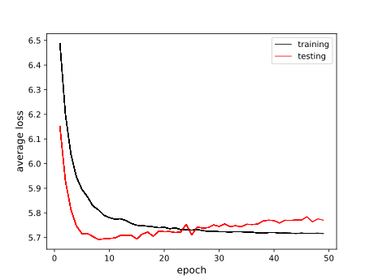
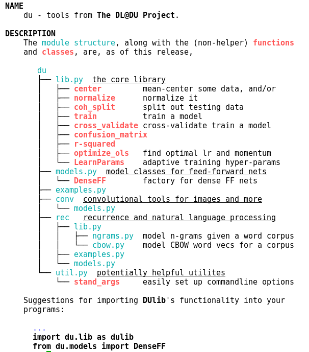
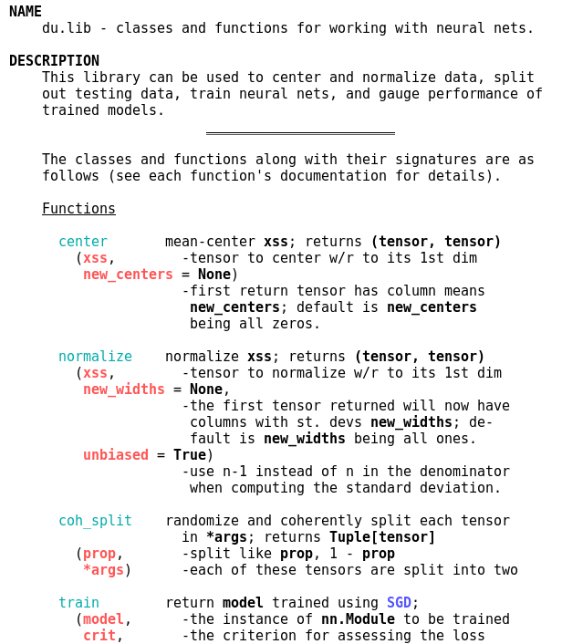

<a id="dldu"></a>
<p align="right"> <b> <a href="https://github.com/sj-simmons/deep-learning#dldu"> The DL@DU Project</a> </b> </p>

### DUlib
---

#### Quickstart
* At the command line, install the latest release:
  `pip3 install DUlib --user` (or `pip install -U DUlib3 --user` in the
  presence of a previously installed version).
* Then have a look at the functions provided by the core library: `pydoc3 du.lib`
* and perhaps some examples of their usage: `pydoc3 du.examples`
* Suppose you decide to use the `train` function.
  Then, in your program, put `from du.lib import train`
* To see what is available in DUlib in addition to the core
  library: `pydoc3 du`
  * and then maybe `pydoc3 du.conv.models` depending on what you are working on.
* You can find programs that together demonstrate the full functionality of `DUlib` at
  the [DL@DU Project](https://github.com/sj-simmons/deep-learning#dldu).
* If you are in the Python interpreter and have imported say the `train`
  function with `from du.lib import train`, then you can get help on `train`
  function with: `help(train)`
* At the command line, you would issue the command `pydoc3 du.lib.train`
  for help on `train`.
* The downstream repo for DUlib
    is: [pypi.org/project/DUlib/](https://pypi.org/project/DUlib/).

---

#### Release information

You can check the version of DUlib that is installed on your system
with: `pip show DUlib` (or `pip3 show DUlib`, if necessary)

**Version 0.1** (March 2019).
  * If you were part of the DL@DU project before about November 1, 2019 and
    you used any of the libraries in the old repo then you can install version 0.1
    ``` bash
    pip install git+https://github.com/sj-simmons/DUlib.git@v0.1  --user
    ```
    and have all your code work as you originally wrote it, with the sole
    exception of modifying the way you import functions from the library. Now,
    you would import some basic functions with:
    ``` python
    from du.lib import center, normalize, train, confusion_matrix
    ```
**Version 0.2** (November 6, 2019).
  * A library for NLP applications, [rec/lib.py](du/rec/lib.py), has been added.

**Version 0.3** (November 14, 2019).
  * Lots of new functionality was added in this release, but there is little reason
    to prefer this over a later release.

**Version 0.6** (November 17, 2019).
  * DUlib now has a downstream repo on [pypi.org](https://pypi.org/) so that it can now
    be installed by simply issuing the command `pip3 install DUlib` (or, depending
    on your setup, `pip3 install DUlib --user`) at the command line.
    * The pypi page is here:
      [pypi.org/project/DUlib](https://pypi.org/project/DUlib)
    * Your DUlib installation can be upgraded with something like `pip3 install -U DUlib --user`
  * The `graph` argument of the train function is now an `int` rather than
    a boolean.  To enable graphing while training (which requires `matplotlib` and
    a running X server) call `train` with the argument `graph = 1`, or put any
    positive number less than the number of epochs over which you are training.

    Here is an example of a graph that was captured at the end of training. This is a picture
    from a dense network training on the digit classification problem.  From the
    graph, it is clear that the network is in danger of over-fitting &mdash; providing
    evidence in support of the mantra that a convolutional network is the preferred flavor
    of network for image classification).

    <p align="center">
      
    </p>

    Putting `graph = 5`, for example, when calling `train`, redraws the graph at epoch 5, throwing
    a way the graph at previous epochs, which can be useful in some instances.

**Version 0.8** (November 21, 2019)
  * The new normal with respect to `device`:

    For most applications involving feedforward nets, you don't really have to
    bother with the `get_device` function (you don't even need to import it) or
    `device`.  The reason is that, in this version of DUlib, the `train` function
    silently takes care of moving things to the best device.

    The point is that activities such as splitting data into training/testing sets,
    centering and normalizing, and gauging accuracy of a trained model are often
    just as well done on the cpu even if you have a gpu. Training is really the
    main activity that you want to do on a gpu &mdash; and, again, DUlib now takes
    care of that for you.

    Likely reasons that you would want to bother with setting `device` are:
    * in the presence of multiple gpus, you want to specifying exactly which gpu you train on.
    * in the presence of gpu(s) you, for whatever reason, want to over-ride the use of a gpu and
      train on the cpu.
    * you want to non-trivially subclass DUlib's `TrainParams_` class.
    * you are creating something interesting using PyTorch's
      [optim](https://pytorch.org/docs/stable/optim.html) package.
    * you are computing r-squared in the presence of high-dimensional data.
    * you are using/building a recurrent net class.
  * The API, particularly in `du.lib`, is stabilizing quickly, as of this release, so it is
    worth it to upgrade. However, in transitioning to version 0.8, you need some
    refactoring. For example:
    * Calling `train` now looks, for example, like this:
      ``` python
      model = train(
          model,
          criterion,
          train_data = (xss_train, yss_train),
          test_data = (xss_test, yss_test),
          learn_params = {'lr': args.lr, 'mo': args.mo},
          epochs = 10)
      ```
      Notice that `learn_params` (the learning parameters) is, in this example,
      a dictionary.  It can also be an instance of the class `LearnParams_` (which is new in version 0.8; do
      `pydoc3 du.examples` to see a simple demonstration of using this class);
      or, `learn_params` can be a prebuilt optimizer from the [optim](https://pytorch.org/docs/stable/optim.html)
      package. (See the documentation for more details: `pydoc3 du.lib.train`).
    * Another change in version 0.8 is that `optimize_ols` now outputs a dict instead of a tuple.
      Hence you can, for example, do
      ``` python
      model = train(
          model,
          criterion,
          train_data = (xss, yss),
          learn_params = optimize_ols(xss),
          epochs = 10)
      ```
  * All code in the [DL@DU projects](https://github.com/sj-simmons/deep-learning#dldu) has been
    refactored to version 0.8.

<a id="latest"></a>
####

**Version 0.8.5** (December 5th, 2019)
  * The current module structure is show below, with the modules in blue and
    some of the more common functions in red.  To view the current module
    structure, and to see suggested usage and more, type `pydoc3 du` at the
    command line.

    <p align="center">
      
    </p>

  * The core library is `du.lib`.  To quickly see usage and synopsis of the
    functions and classes available in `du.lib`, type `pydoc3 du.lib` at the
    command line (and scroll down to peruse detailed usage).

    <p align="center">
      
    </p>

---

#### Modifying DUlib

If you want to experiment with the code in the libraries, then you can clone
to a local repo on your machine:
``` bash
git clone https://github.com/sj-simmons/DUlib.git --user
```
Suppose you clone to a local repo and modify or add to the code in the libraries,
and then you want to install (directly from your local repo) the modified
libraries to your local machine:
``` bash
cd DUlib
pip install -e .
```
Now suppose that you want to revert back to the latest release:
``` bash
pip install git+https://github.com/sj-simmons/DUlib.git --user
```
or just
``` bash
pip install -U DUlib --user
```

Please let Simmons know of any new functionality that you implement and wish
to add to DUlib. Or just fork, create/fix/modify, and issue a pull request.
